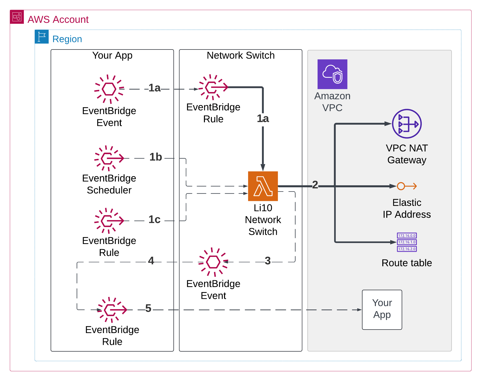

<center>
    <picture>
        <source media="(prefers-color-scheme: dark)" srcset="./docs/img/li10-logo-dark-bg.svg">
        <source media="(prefers-color-scheme: light)" srcset="./docs/img/li10-logo-light-bg.svg">
        
    </picture>

This repository is supported by Li10.
</br>
Check out <a href="https://www.li10.com">www.li10.com</a> to learn more.
</center>

</br>

# Li10 Network Switch
<b>Li10 Network Switch</b> is simple tool to turn on/off networking resources (AWS NAT Gateway and Elastic IP) so that they run only when they are needed. This solution eliminates unnecessary cost and carbon footprint from your cloud environment.

This tool is useful for applications which have an intermitent need for internet access. It can take a minute to turn the NAT on. If you run a website, this solution is not appropriate.

Your application can integrate with the Li10 Network Switch using AWS EventBridge Events or invoking the Lambda function directly. It will deploy, configure or remove the targetted NAT Gateway, Elastic IP and VPC Routes. The Lambda can be instructed to fire a custom event in the Event Bridge once the task is completed.

Using this solution, we reduced 99.9% of the cost 💰 and carbon footprint 💚 generated by the NAT Gateway in our own environment. If you are curious about how we can make this insane marketing claim, here is the math. Our ECS task only need to run for 10 minutes per day. We pay for 10 minutes of NAT per day instead of 24 hours per day.

$$reduction = { 1 - {\text{10 minutes for our ECS task to run per day} \over \text{1440 minutes in a day}} } = 99.9 \% $$

And we rounded it down to make up for the tiny infrastructure cost of the Li10 NAT Switch itself. 🎉

# Architecture
The following diagram shows the infrastructure of <b>Li10 Network Switch</b> which can be deployed in your AWS environment.



1. You have several options to instruct the Lambda to turn the NAT ON or OFF

    1a. By firing an EventBridge Event, the EventBridge Rule deployed with the solution will trigger the Lambda function.

    1b. A Scheduler can trigger the Lambda function directly.

    1c. An EventBridge Rule can listen for specific events to trigger the Lambda. For example, you can configure the Rule to wait for the event informating an ECS task was stopped to tell the Lambda to turn off networking.

2. The Lambda reads the information provided in the event to turn ON or OFF networking. It will create or delete the NAT and Elastic IP and re-configure the VPC Routes.

3. If a follow-up event was embeded in the event in step 1, the Lambda will fire that event.

4. A Rule can be created to capture the event from step 3.

5. The Rule can then inform your application that the network is up, eg by starting an ECS task.


You can look in the Li10 Governance repo to see how we use it. In our case the flow is:

- The Scheduler (1b) triggers a daily scan through the Li10 Switch Lambda. It tell the Lambda to turn the NAT on and fire a follow-up event to start the ECS task.

- The Lambda (2) turns the NAT on.

- Once the NAT is up, the follow-up event (3) is picked up (4) by the Rule, which start the ECS task (5).

- Once the ECS Task is completed, AWS ECS triggers an event which is picked up by the Rule (1c) and instruct Lambda to turn off the NAT.

As a result, the NAT is up only briefly before and briefly after the ECS task run.

# Repo structure
```
.gitlab/        Contains the GitLab Jobs used to deploy this solution
cdk/            Contains the AWS CDK code
lambda-code/    Contains the code for the lambda function
app.py          Contains the deployment configuration
```

# Setup
1/ A VPC must be created. This tool will not create a VPC, just modify an existing one.

2/ Deploy the solution using a pipeline. A Gitlab pipeline is provided as example.

3/ Integrate your app with the Network Switch by deploying an EventBridge Rule, fire an Event or invoke the Lambda directly.

# Event format
## Event format
<table>
<tr><th>field</th><th>value</th><th>description</th><tr>
<tr><td>detail-type</td><td>li10-switch</td><td>constant value used by the Event Bridge Rule to capture the events</td></tr>
<tr><td>action</td><td>create|delete</td><td>determine whether Lambda should turn the NAT Gateway ON or OFF</td></tr>
<tr><td>name</td><td>any</td><td>Name used for the NAT Gateway and Elastic IP created</td></tr>
<tr><td>subnet_id</td><td>eg: subnet-0fbcdb933cc4c95f1</td><td>set to the subnet Id of the public subnet where to create the NAT</td></tr>
<tr><td>follow-up-event</td><td>"follow-up-event": { "action": "scan", "source": "li10-governance" }</td><td>optional map used to fire an EventBridge event once the Lambda completed its task.</td></tr>

</table>

## Turn ON event
```json
{
    "detail-type": "li10-switch",
    "detail": {
        "action": "create",
        "name": "li10-ephemeral-nat",
        "subnet_id": "subnet-0fbcdb933cc4c95f1",
    }
}
```
You can send it with this command:
```shell
aws events put-events --entries '[{
  "Source": "li10-switch",
  "DetailType": "li10-switch: turn NAT on or off",
  "Detail": "{\"action\": \"create\", \"name\": \"li10-ephemeral-nat\", \"subnet_id\": \"subnet-0fbcdb933cc4c95f1\"}"
}]' --profile li10-dev --region eu-west-3
```

## Turn ON event with optional follow-up event
```json
{
    "detail-type": "li10-switch",
    "detail": {
        "action": "create",
        "name": "li10-ephemeral-nat",
        "subnet_id": "subnet-0fbcdb933cc4c95f1",
        "follow-up-event": {
            "action": "scan",
            "source": "li10-governance"
        }
    }
}
```
You can send it with this command:
```shell
aws events put-events --entries '[{
  "Source": "li10-switch",
  "DetailType": "li10-switch: turn NAT on or off",
  "Detail": "{\"action\": \"create\", \"name\": \"li10-ephemeral-nat\", \"subnet_id\": \"subnet-0fbcdb933cc4c95f1\", \"follow-up-event\": { \"action\": \"scan\", \"source\": \"li10-governance\" }}"
}]' --profile li10-dev --region eu-west-3
```

## Turn OFF event
```json
{
    "detail-type": "li10-switch",
    "detail": {
        "action": "delete",
        "name": "li10-ephemeral-nat"
    }
}
```
You can send it with this command:
```shell
aws events put-events --entries '[{
  "Source": "li10-switch",
  "DetailType": "li10-switch: turn NAT on or off",  
  "Detail": "{\"action\": \"delete\", \"name\": \"li10-ephemeral-nat\"  }"
  }]' --profile li10-dev --region eu-west-3
```

# Test locally

The python script can be executed locally:
```
python main.py -h
usage: main.py [-h] [--subnet-id SUBNET_ID] [--profile PROFILE] [--region REGION] {create,delete} name

Add or remove an AWS NAT Gateway from a VPC

positional arguments:
  {create,delete}       Action to perform
  name                  Name of the NAT Gateway

options:
  -h, --help            show this help message and exit
  --subnet-id SUBNET_ID
                        Subnet ID for creating NAT Gateway
  --profile PROFILE     AWS profile to use
  --region REGION       AWS region to use
```
